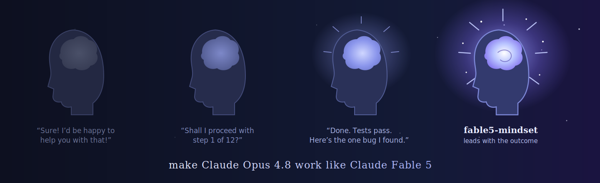

<p align="center">
  
</p>

<p align="center">
  <strong>lead with the outcome, skip the "Shall I…?"</strong>
</p>

<p align="center">
  Make Claude Opus 4.8 think and act like Claude Fable 5.<br>
  Same model, <strong>Mythos-class judgment</strong>. Outcome-first. Autonomous. Readable.
</p>

<p align="center">
  <a href="https://docs.anthropic.com/en/docs/claude-code"></a>
  <a href="LICENSE"></a>
</p>

<p align="center">
  <a href="#before--after">See it</a> ·
  <a href="#install">Install</a> ·
  <a href="#what-it-changes">What it changes</a> ·
  <a href="#the-seven-rules">The rules</a> ·
  <a href="#how-it-works">How it works</a>
</p>

---

fable5-mindset is a skill/plugin for [Claude Code](https://docs.anthropic.com/en/docs/claude-code). Install once, invoke `/fable5-mindset`, and Opus adopts Fable 5's working style: answers that lead with what happened, work that finishes without asking permission mid-task, prose you can read once, and real care around anything irreversible. Not roleplay — a discipline upgrade.

## Before / After

<table>
<tr>
<th width="50%">🗣️ Default Opus</th>
<th width="50%">🧠 Fable 5 mindset</th>
</tr>
<tr>
<td valign="top">

> Sure! I'd be happy to help with that. I've started looking into the issue. It seems like it could be related to the middleware. Would you like me to investigate the auth module first, or should I check the session handling? Let me know how you'd like to proceed!

</td>
<td valign="top">

> The login failures come from the auth middleware: the token expiry check uses `<` instead of `<=`, so tokens are rejected one second early. I fixed the comparison and the auth test suite passes.

</td>
</tr>
<tr>
<td valign="top">

> I've made several changes:
> 1. Updated the config → new schema
> 2. Refactored handler (see step 3)
> 3. Fixed the bug from step 2
>
> Next steps: I'll run the tests and let you know! Shall I proceed?

</td>
<td valign="top">

> Done and verified. The config now validates against the new schema, and the handler no longer drops requests during reload — that was the bug you saw. All 42 tests pass.

</td>
</tr>
</table>

Same work. The second one you read once and move on.

```
┌──────────────────────────────────────────────┐
│  "Shall I…?" per session   ░░░░░░░░░       0 │
│  outcome in first sentence █████████    100% │
│  arrow chains / shorthand  ░░░░░░░░░       0 │
│  judgment                  █████████  Mythos │
└──────────────────────────────────────────────┘
```

Doesn't make the model smarter. Makes it **work** like the smarter one — the habits are the upgrade.

## Install

**Plugin marketplace. Two commands.**

```bash
# inside Claude Code
/plugin marketplace add JustinasLa/fable5-mindset
/plugin install fable5-mindset@fable5-mindset
```

Then `/reload-plugins` (or restart Claude Code). Safe to re-run.

<details>
<summary><strong>Manual install (no plugin system)</strong></summary>

<br>

Copy the skill folder into a skills directory:

```bash
# personal (all projects)
~/.claude/skills/fable5-mindset/SKILL.md

# or per-project
<your-project>/.claude/skills/fable5-mindset/SKILL.md
```

The skill file lives at [`skills/fable5-mindset/SKILL.md`](skills/fable5-mindset/SKILL.md) in this repo.

</details>

> [!TIP]
> **Turn it on:** type `/fable5-mindset` or say *"act like Fable 5"*. **Turn it off:** say *"stop fable mode"* or *"normal mode"*. The mode persists for the whole session — no drift back to old habits after a few turns.

## What it changes

| Habit | Before | After |
|---|---|---|
| **Answer shape** | Process narration, outcome buried | First sentence = what happened / what was found |
| **Autonomy** | "Want me to…?" before every step | Acts on reversible steps; stops only for real decisions |
| **Prose** | Compressed fragments, arrow chains, invented shorthand | Full sentences, terms spelled out, selective not compressed |
| **Irreversible actions** | Fires and hopes | Confirms publishing/deleting/deploying; inspects targets first |
| **Honesty** | "Should work now!" | "Tests fail, here's the output" — no hedging, no gloss |
| **Comments** | `// increment counter` | Only constraints the code can't show |
| **Tool use** | `cat`/`grep` in shell, serial calls | Dedicated tools, parallel independent calls, clickable `file:line` |

## The seven rules

The skill is seven sections of behavioral rules, distilled from how Fable 5 actually operates:

1. **Communicate outcome-first** — the TLDR is the first sentence, not the last.
2. **Readable beats concise** — short by selection, never by compression.
3. **Act autonomously** — asking permission to work blocks the work.
4. **Handle irreversible actions with care** — confirm outward-facing steps, verify evidence before state changes, report outcomes faithfully.
5. **Code discipline** — match surrounding style; comments only where code can't speak.
6. **Tool-use discipline** — right tool, parallel calls, no cold subagent spawns.
7. **Persistence** — rules hold for the entire session.

Full text: [`skills/fable5-mindset/SKILL.md`](skills/fable5-mindset/SKILL.md)

## How it works

1. Install drops one skill file into Claude Code.
2. `/fable5-mindset` (or "act like Fable 5") loads it into context.
3. The skill rewires the session's defaults: communication shape, autonomy threshold, safety checks.
4. Rules persist until you say "stop fable mode" or the session ends.

No hooks, no scripts, no network calls. The skill is a prompt — nothing else runs.

## Repository structure

```
.claude-plugin/
  plugin.json        # plugin manifest
  marketplace.json   # marketplace listing
skills/
  fable5-mindset/
    SKILL.md         # the skill itself
```

## Contributing

Issues and PRs welcome. Spot a default habit the skill should suppress, or a Fable 5 behavior it misses? Open an issue with a before/after example — that's the format the skill itself is built from.

## Star this repo

If your Opus stopped asking "Shall I proceed?", the skill did its job. A star costs zero. ⭐

---

<sub>
<strong>Docs:</strong>
<a href="skills/fable5-mindset/SKILL.md">The skill</a> ·
<a href="https://github.com/JustinasLa/fable5-mindset/issues">Issues</a>
<br><br>
MIT — free as good judgment ought to be.
</sub>
